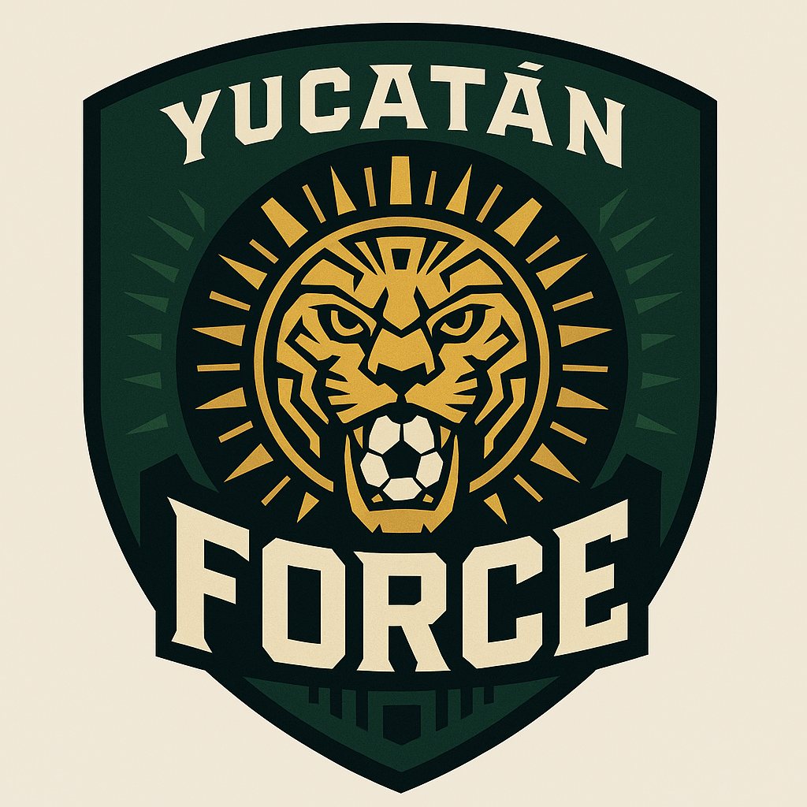
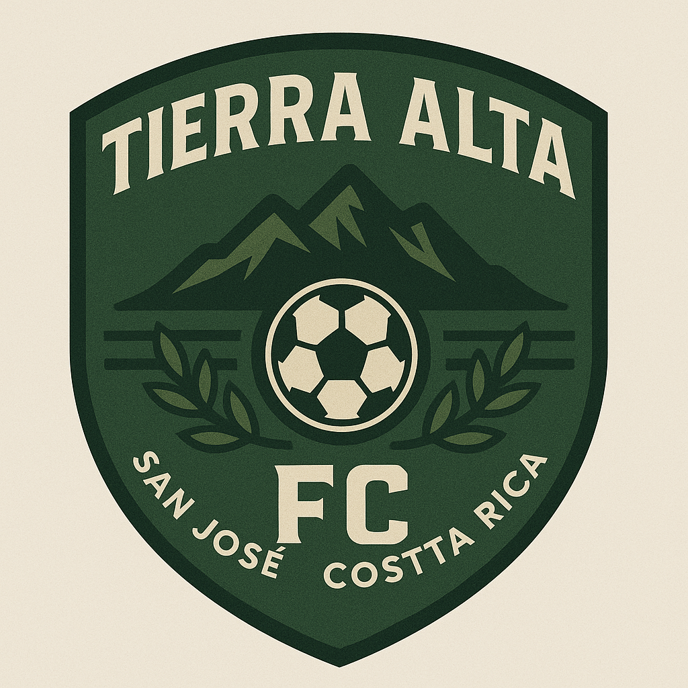
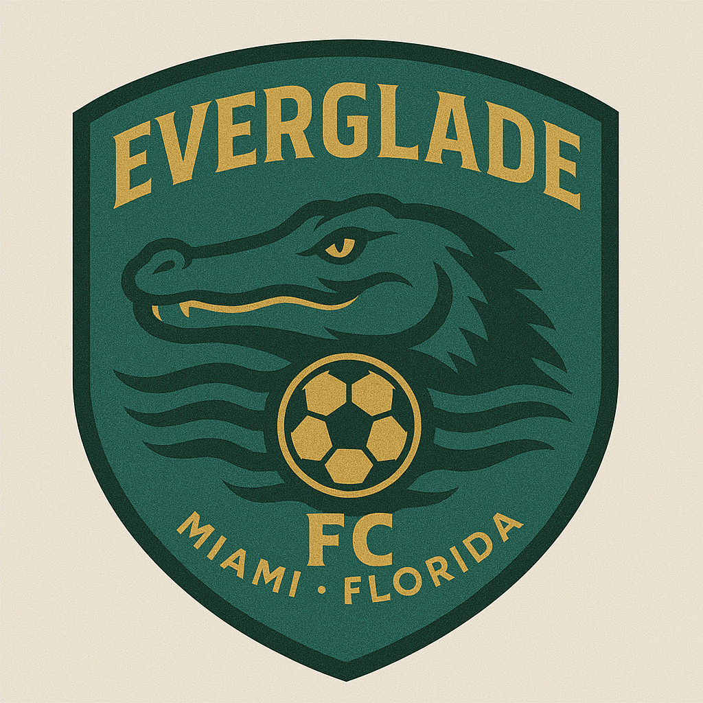
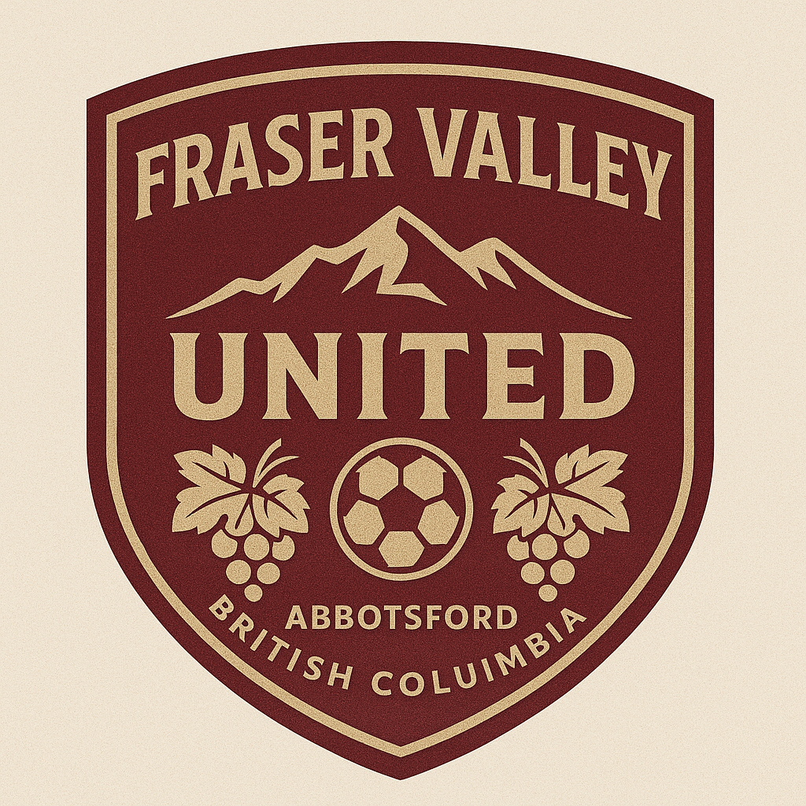

# Huge League

- Standard size: 23 players (11 starters + 7 bench + 2-5 reserves/prospects).
- Age range: Mostly 20–31, with 1–2 teenage prospects.
- Shirt numbers: 1–23, with traditional starter numbers used.
- Positions: Based on a 4-3-3 setup; easily adaptable.
- You can add custom flair per team (nationalities, names, local youth academy, etc.) when generating full CSVs.

Basic team layout:

| Player # | Name Placeholder | Position         | Age | Nationality Placeholder | Shirt # | Preferred Foot | Role             |
|----------|------------------|------------------|-----|--------------------------|---------|----------------|------------------|
| 1        | GK_1             | Goalkeeper       | 29  |                          | 1       | Right          | Starter          |
| 2        | LB_1             | Left Back        | 25  |                          | 3       | Left           | Starter          |
| 3        | CB_1             | Center Back      | 28  |                          | 4       | Right          | Starter          |
| 4        | CB_2             | Center Back      | 30  |                          | 5       | Right          | Starter          |
| 5        | RB_1             | Right Back       | 24  |                          | 2       | Right          | Starter          |
| 6        | CDM_1            | Defensive Mid    | 27  |                          | 6       | Right          | Starter          |
| 7        | CM_1             | Central Mid      | 26  |                          | 8       | Right          | Starter          |
| 8        | CM_2             | Central Mid      | 23  |                          | 10      | Left           | Starter          |
| 9        | LW_1             | Left Wing        | 22  |                          | 11      | Right          | Starter          |
| 10       | ST_1             | Striker          | 28  |                          | 9       | Right          | Starter          |
| 11       | RW_1             | Right Wing       | 24  |                          | 7       | Left           | Starter          |
| 12       | GK_2             | Goalkeeper       | 21  |                          | 13      | Right          | Bench            |
| 13       | CB_3             | Center Back      | 32  |                          | 15      | Left           | Bench            |
| 14       | FB_2             | Full Back        | 20  |                          | 17      | Right          | Bench            |
| 15       | CDM_2            | Defensive Mid    | 29  |                          | 12      | Right          | Bench            |
| 16       | CM_3             | Central Mid      | 22  |                          | 14      | Right          | Bench            |
| 17       | AM_1             | Attacking Mid    | 25  |                          | 18      | Left           | Bench            |
| 18       | FW_2             | Forward/Winger   | 19  |                          | 16      | Right          | Bench            |
| 19       | ST_2             | Striker          | 31  |                          | 19      | Left           | Bench            |
| 20       | LW_2             | Left Wing        | 26  |                          | 20      | Left           | Bench            |
| 21       | RW_2             | Right Wing       | 23  |                          | 21      | Right          | Bench            |
| 22       | U21_Prospect_1   | Various          | 18  |                          | 22      | Mixed          | Reserve/Prospect |
| 23       | U21_Prospect_2   | Various          | 17  |                          | 23      | Mixed          | Reserve/Prospect |

# Teams

## Yucatán Force — Mérida, Mexico

Deep in the Mayan heartland, this team blends cultural pride with raw talent. Their fortress-like stadium is known as El Templo del Sol — The Temple of the Sun.

- [Roster](rosters/Yucatan_Force_Roster.csv)

## Tierra Alta FC — San José, Costa Rica

Named for the highlands of Costa Rica, this team champions sustainability and tactical intelligence. Their lush green stadium is solar-powered and ringed by cloud forest.

- [Roster](rosters/Tierra_Alta_FC_Roster.csv)

## Everglade FC — Miami, Florida

Fast, flashy, and fiercely proud of their roots in the wetlands, Everglade FC plays with flair under the humid lights of South Florida. Their style is as wild and unpredictable as the ecosystem they represent.

- [Roster](rosters/Everglade_FC_Roster.csv)

## Fraser Valley United — Abbotsford, British Columbia

Surrounded by vineyards and mountains, this team brings together rural BC pride with west coast sophistication. Known for their academy program, they're a pipeline for Canadian talent.

- [Roster](rosters/Fraser_Valley_United_Roster.csv)

