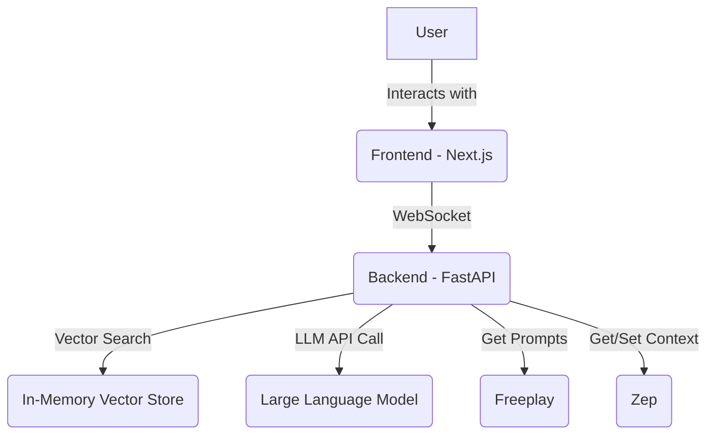
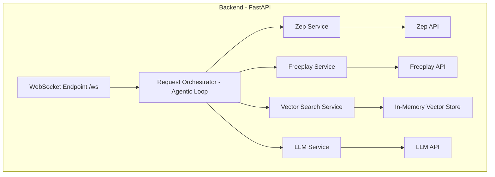

# Full Stack Architecture: Huge IFX Soccer AI Demo

## 1. Overview

This document outlines the full-stack architecture for the Huge IFX Soccer AI Demo. The system is designed as a real-time, conversational AI application that allows users to interact with a fictional soccer league through a chat-based interface. The architecture prioritizes a decoupled, modular design to facilitate rapid development, testing, and future scalability.

The core of the application is a real-time streaming architecture using WebSockets to provide a responsive and engaging user experience. The system is composed of a Next.js frontend and a Python/FastAPI backend, deployed in a monorepo structure.

## 2. Architectural Goals and Constraints

### Goals

*   **Real-time Interaction:** The architecture must support low-latency, real-time communication between the frontend and backend.
*   **Modularity:** The system should be composed of loosely coupled components, allowing for easy replacement of the LLM, vector store, or other services.
*   **Scalability:** While the MVP is a demo, the architecture should be designed with future scalability in mind.
*   **Developer Experience:** The monorepo and decoupled services are intended to provide a smooth development experience.

### Constraints

*   **Frontend Technology:** The frontend stack is fixed: Next.js, React, TypeScript, and `shadcn/ui`.
*   **Backend Technology:** The backend stack is fixed: Python and FastAPI.
*   **MVP Focus:** The initial implementation will focus on the MVP scope outlined in the PRD, with an in-memory vector store.

## 3. System Architecture

The system follows a classic decoupled frontend-backend architecture.

*   **Frontend:** A Next.js application responsible for rendering the UI, managing user interactions, and communicating with the backend via WebSockets.
*   **Backend:** A FastAPI application that handles the core business logic, including WebSocket communication, vector search, and LLM integration.



## 4. Frontend Architecture

The frontend is a Next.js application using the App Router.

*   **Framework:** Next.js
*   **Language:** TypeScript
*   **UI Components:** `shadcn/ui`
*   **State Management:** React hooks and context for local state. For a larger application, a more robust state management library like Zustand or Redux could be considered.
*   **Communication:** A dedicated WebSocket client will be implemented to handle the real-time communication with the backend. This client will be responsible for sending user queries and receiving and processing the stream of responses (assets, text chunks, status updates).
*   **Component Structure:** The UI is broken down into reusable components as described in the `front-end-spec.md`: `AssetDisplay`, `ChatHistory`, `ChatInput`, and `DevPanel`.

## 5. Backend Architecture

The backend is a Python application built with the FastAPI framework, designed for modularity, real-time communication, and agentic behavior. It will be built as a custom, lightweight agent and will not use a framework like LangGraph, to allow for fine-grained control over the user experience.



### 5.1. Backend Application Layout

This section outlines the directory structure and component breakdown for the FastAPI backend application located in the `/app` directory.

#### Directory Structure

```
/app
├── __init__.py
├── main.py
├── services/
│   ├── __init__.py
│   ├── orchestrator.py
│   ├── zep_service.py
│   ├── freeplay_service.py
│   ├── vector_search_service.py
│   └── llm_service.py
├── core/
│   ├── __init__.py
│   └── config.py
└── data_models/
    ├── __init__.py
    └── models.py
```

#### Component Descriptions

##### `main.py`

This file serves as the main entry point for the FastAPI application.

*   **Responsibilities:**
    *   Instantiate the FastAPI application.
    *   Define the WebSocket endpoint (`/ws`) for real-time communication.
    *   Manage application lifecycle events, such as the startup event to load the in-memory vector store.

##### `services/`

This directory contains the core business logic of the application, with each service encapsulated in its own module.

*   **`orchestrator.py`**: The central agentic loop that orchestrates the calls to the other services.
*   **`zep_service.py`**: Handles all interactions with the Zep API for context and memory management.
*   **`freeplay_service.py`**: Manages fetching versioned prompts from the Freeplay API.
*   **`vector_search_service.py`**: Responsible for loading the data and performing similarity searches on the in-memory vector store.
*   **`llm_service.py`**: A client for interacting with the chosen Large Language Model.

##### `core/`

This directory is for core application concerns that are not part of the main business logic.

*   **`config.py`**: Manages all application settings and secrets, loading them from environment variables.

##### `data_models/`

This directory contains the Pydantic models used for data validation and serialization.

*   **`models.py`**: Defines the data structures for API requests and responses, including the WebSocket message protocol.


### 5.2. Component Breakdown

*   **WebSocket Endpoint (`/ws`):** The single point of entry for all client communication. It manages the persistent connection and hands off incoming messages to the Request Orchestrator. It will also be responsible for sending status updates ("toasts") to the client.

*   **Request Orchestrator (Agentic Loop):** This is the heart of the backend logic. It implements a ReAct (Reason and Act) style loop to create an agentic experience. It receives a user query from the WebSocket and orchestrates the calls to the various services in the correct sequence. The orchestrator will run asynchronously to enable responsive UI patterns.

*   **Zep Service:** A dedicated service that encapsulates all interactions with the Zep API.
    *   **Responsibilities:**
        *   Retrieving the conversation history for the current session.
        *   Storing new user and AI messages.
        *   Managing user preferences and other context.
    *   **Implementation:** This service will use the Zep Python SDK.

*   **Freeplay Service:** A service responsible for fetching versioned prompts from Freeplay.
    *   **Responsibilities:**
        *   Calling the Freeplay API to get the appropriate system prompt for a given task.
    *   **Implementation:** This service will make HTTP requests to the Freeplay API.

*   **Vector Search Service:** This service is responsible for finding the most relevant asset for a given query.
    *   **Responsibilities:**
        *   Loading the player and team data into an in-memory vector store at startup.
        *   Providing a method to perform a similarity search on the vector store.
    *   **Implementation:** This will use a library like FAISS to create and search the in-memory vector store.

*   **LLM Service:** A client that interacts with the chosen Large Language Model. It will be built with an abstraction layer (e.g., using a library like LiteLLM) to allow for easy switching between LLM providers.
    *   **Responsibilities:**
        *   Constructing the final prompt using the user query, the context from Zep, the system prompt from Freeplay, and the results from the vector search.
        *   Making the streaming API call to the LLM.
        *   Streaming the LLM's response back to the Request Orchestrator.

### 5.3. Data Flow and Responsive UX

The data flow is designed to provide a highly responsive user experience. The backend will use `asyncio` to perform tasks concurrently and send information to the client as soon as it's available.

1.  The user sends a `user_query` message through the WebSocket.
2.  The **WebSocket Endpoint** receives the message and passes it to the **Request Orchestrator**. The orchestrator immediately sends a `status` message (e.g., "Thinking...") to the client.
3.  The **Request Orchestrator** asynchronously calls the **Vector Search Service**.
4.  As soon as the **Vector Search Service** returns a result, the **Request Orchestrator** immediately sends the `asset` message to the client, so the user sees the image without waiting for the text.
5.  While the asset is being sent, the **Request Orchestrator** can be concurrently calling the **Zep Service** to get context and the **Freeplay Service** to get the system prompt.
6.  Once all the necessary information is gathered, the **Request Orchestrator** calls the **LLM Service**.
7.  The **LLM Service** streams the response back to the **Request Orchestrator**, which in turn streams it to the client as a series of `text_chunk` messages.
8.  Once the stream is complete, a `stream_end` message is sent.
9.  The **Request Orchestrator** then calls the **Zep Service** again to save the new user query and the AI's response to the conversation history.

*   **Containerization:** The backend application will be containerized using Docker for consistent deployment and execution.

## 6. Data Management

*   **Content:** The fictional player and team data is stored as JSON files in the `data/huge-league/players` directory.
*   **Vector Store:** For the MVP, an in-memory vector store (e.g., FAISS) will be used. This store will be populated with embeddings of the player and team data at application startup.
*   **Session Data:** Session-specific data, such as conversation history and user preferences (e.g., favorite team), will be managed by Zep.

## 7. Communication Protocol

Communication between the frontend and backend will be exclusively over WebSockets. The following message types are defined:

*   **Client to Server:**
    *   `user_query`: A JSON message containing the user's text query.

*   **Server to Client:**
    *   `asset`: A JSON message containing the URL or data of the visual asset found by the vector search.
    *   `text_chunk`: A JSON message containing a chunk of the streamed text response from the LLM.
    *   `stream_end`: A JSON message indicating the end of the text stream.
    *   `status`: A JSON message to provide real-time feedback on the system's status (e.g., "Searching for players...").

## 8. External Services

*   **Freeplay:** Used for managing and versioning system prompts. This allows for prompt updates without code deployments and provides a collaborative environment for prompt engineering.
*   **Zep:** A context engineering platform that provides agent memory and personalized context. Zep will be used to manage user preferences, traits, and conversation history, which will help to reduce hallucinations and improve the accuracy of the LLM.

## 9. Deployment and Infrastructure

*   **Frontend:** The Next.js frontend will be deployed on Vercel, leveraging its CI/CD capabilities for automatic deployments from the `main` branch.
*   **Backend:** The Dockerized FastAPI backend will be deployed to a container hosting service. Vercel is a possibility, but other services like Google Cloud Run or AWS Fargate are also suitable alternatives.
*   **Monorepo Deployment:** The Vercel project will be configured to correctly build and deploy the frontend and backend from their respective directories within the monorepo.

## 10. Security & Compliance

*   **Input Sanitization:** All user input from the chat interface will be sanitized on the backend to prevent injection attacks.
*   **API Keys:** Keys for the LLM service, Freeplay, Zep, and other external APIs must be stored securely as environment variables and not exposed on the client-side.
*   **WebSocket Security:** The WebSocket connection will use the secure `wss://` protocol in production.
*   **Authentication & Authorization:** For the MVP, there is no authentication. In the future, a standard JWT-based authentication mechanism could be implemented.

## 11. Resilience & Operational Readiness

*   **Logging:** A structured logging strategy will be implemented using a library like `structlog`. All logs will be written to `stdout` and `stderr` to be collected by the container orchestration platform.
*   **Monitoring:** For the MVP, basic health checks will be exposed via a `/health` endpoint. In the future, a more comprehensive monitoring solution like Prometheus and Grafana could be implemented to track key metrics like request latency, error rates, and resource utilization.
*   **Alerting:** For the MVP, no specific alerting is planned. In the future, alerts can be configured based on the metrics collected by the monitoring solution.
*   **Error Handling:** The backend will implement a centralized error handling mechanism to catch and log all unhandled exceptions. For expected errors (e.g., external service failures), the system will implement a retry mechanism with exponential backoff.

## 12. Implementation Guidance

*   **Coding Standards:** The backend will follow the PEP 8 style guide. The frontend will follow the standard Next.js and TypeScript best practices.
*   **Testing Strategy:** The testing strategy will include unit tests for individual components and integration tests for the communication between services. For the backend, `pytest` will be used. For the frontend, `jest` and `react-testing-library` will be used.
*   **Source Control:** The project will follow a standard GitFlow workflow with a `main` branch for production and feature branches for development.

## 13. Future Considerations

*   **Scalable Vector Store:** For a production application, the in-memory vector store should be replaced with a managed, scalable solution like Pinecone, Weaviate, or a cloud-native vector database.
*   **Persistent User Data:** To support features beyond session-based personalization, a database (e.g., PostgreSQL, MongoDB) and a user authentication system would be required.
*   **Stateful Backend:** For more complex conversational flows and to better manage user sessions, a stateful backend architecture or a distributed cache like Redis could be implemented.

## 14. Tech Stack

This document outlines the technology stack for the Huge IFX Soccer project, as derived from project standards and the Product Requirements Document (PRD).

### Backend

- **Language:** Python 3.13
- **Framework:** FastAPI
- **Package Manager:** Poetry
- **Containerization:** Docker
- **Vector Store:** In-memory, using LangChain with FAISS.
- **LLM:** A high-performance model from a major provider (e.g., Google, OpenAI, Anthropic).

### Frontend

- **Language:** JavaScript/TypeScript
- **Framework:** React
- **Build Tool:** Vite
- **UI Library:** shadcn/ui

### Development & Infrastructure

- **Repository:** GitHub
- **Development Environment:** GeminiCLI
- **Hosting:** Vercel (for both frontend and backend services).
- **Communication:** WebSockets for real-time, bidirectional communication between frontend and backend.

## 15. Coding Standards

This document outlines the coding standards and conventions to be followed for the Huge IFX Soccer project. These are based on the global standards defined for the project.

### Python (Backend)

- **Formatting:** We use single quotes (`'`) for strings unless a double quote (`"`) is required within the string. We use `ruff` to format and lint our code.
- **Typing:** All function signatures must have type hints. No exceptions.
- **Paths:** Use the `pathlib` library for all filesystem path manipulations. It's cleaner and more expressive.

#### Unit tests

- All unit and integration tests must use the `pytest` framework.
- Prefer using `pytest` markers (e.g., `@pytest.mark.integration`) to distinguish test types.
- Each test function should include a docstring describing its intent.
- Assertions should include helpful error messages for easier debugging.
- Tests should be simple, readable, and leverage pytest features (fixtures, parametrization, etc.) where beneficial.

### Frontend

(Frontend-specific standards to be defined, e.g., for React/TypeScript).

## 16. Source Tree

This document describes the source tree structure for the Huge IFX Soccer monorepo.

### Monorepo Structure

The project is organized as a monorepo to simplify development and dependency management. The primary directories are:

- **`/app`**: Contains the backend Python application, built with FastAPI.
- **`/ifx-app`**: Contains the frontend React application, built with Vite.
- **`/docs`**: Contains all project documentation, including the PRD and architecture documents.
- **`/data`**: Contains data for the fictional Huge League, including teams, players, and logos.
- **`/tests`**: Contains tests for the application.
- **`/.bmad-core`**: Contains the configuration and tasks for the BMad development methodology.
- **`/.gemini`**: Contains configuration and context for the Gemini CLI.
