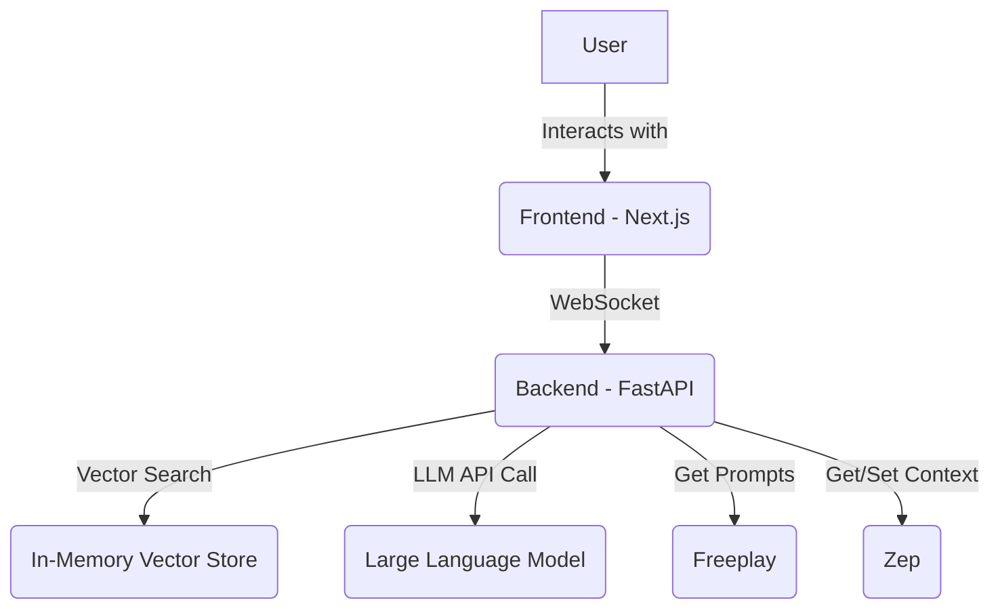

# 3. System Architecture

The system follows a classic decoupled frontend-backend architecture.

*   **Frontend:** A Next.js application responsible for rendering the UI, managing user interactions, and communicating with the backend via WebSockets.
*   **Backend:** A FastAPI application that handles the core business logic, including WebSocket communication, vector search, and LLM integration.

