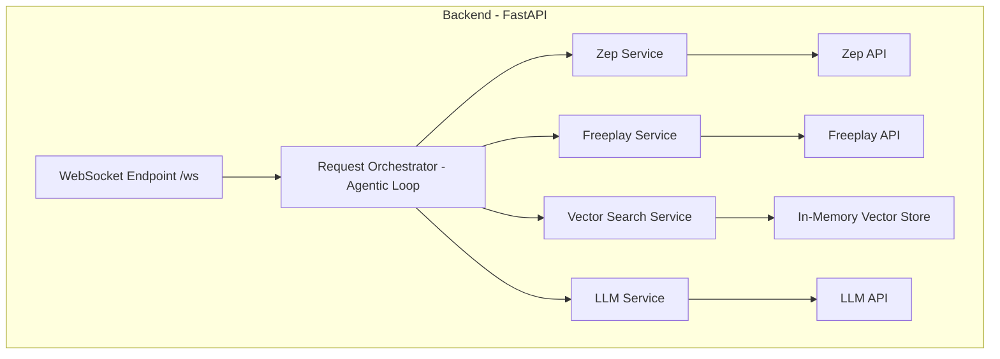

# 5. Backend Architecture

The backend is a Python application built with the FastAPI framework, designed for modularity, real-time communication, and agentic behavior. It will be built as a custom, lightweight agent and will not use a framework like LangGraph, to allow for fine-grained control over the user experience.



## 5.1. Backend Application Layout

This section outlines the directory structure and component breakdown for the FastAPI backend application located in the `/app` directory.

### Directory Structure

```
/app
├── __init__.py
├── main.py
├── services/
│   ├── __init__.py
│   ├── orchestrator.py
│   ├── zep_service.py
│   ├── freeplay_service.py
│   ├── vector_search_service.py
│   └── llm_service.py
├── core/
│   ├── __init__.py
│   └── config.py
└── data_models/
    ├── __init__.py
    └── models.py
```

### Component Descriptions

#### `main.py`

This file serves as the main entry point for the FastAPI application.

*   **Responsibilities:**
    *   Instantiate the FastAPI application.
    *   Define the WebSocket endpoint (`/ws`) for real-time communication.
    *   Manage application lifecycle events, such as the startup event to load the in-memory vector store.

#### `services/`

This directory contains the core business logic of the application, with each service encapsulated in its own module.

*   **`orchestrator.py`**: The central agentic loop that orchestrates the calls to the other services.
*   **`zep_service.py`**: Handles all interactions with the Zep API for context and memory management.
*   **`freeplay_service.py`**: Manages fetching versioned prompts from the Freeplay API.
*   **`vector_search_service.py`**: Responsible for loading the data and performing similarity searches on the in-memory vector store.
*   **`llm_service.py`**: A client for interacting with the chosen Large Language Model.

#### `core/`

This directory is for core application concerns that are not part of the main business logic.

*   **`config.py`**: Manages all application settings and secrets, loading them from environment variables.

#### `data_models/`

This directory contains the Pydantic models used for data validation and serialization.

*   **`models.py`**: Defines the data structures for API requests and responses, including the WebSocket message protocol.


## 5.2. Component Breakdown

*   **WebSocket Endpoint (`/ws`):** The single point of entry for all client communication. It manages the persistent connection and hands off incoming messages to the Request Orchestrator. It will also be responsible for sending status updates ("toasts") to the client.

*   **Request Orchestrator (Agentic Loop):** This is the heart of the backend logic. It implements a ReAct (Reason and Act) style loop to create an agentic experience. It receives a user query from the WebSocket and orchestrates the calls to the various services in the correct sequence. The orchestrator will run asynchronously to enable responsive UI patterns.

*   **Zep Service:** A dedicated service that encapsulates all interactions with the Zep API.
    *   **Responsibilities:**
        *   Retrieving the conversation history for the current session.
        *   Storing new user and AI messages.
        *   Managing user preferences and other context.
    *   **Implementation:** This service will use the Zep Python SDK.

*   **Freeplay Service:** A service responsible for fetching versioned prompts from Freeplay.
    *   **Responsibilities:**
        *   Calling the Freeplay API to get the appropriate system prompt for a given task.
    *   **Implementation:** This service will make HTTP requests to the Freeplay API.

*   **Vector Search Service:** This service is responsible for finding the most relevant asset for a given query.
    *   **Responsibilities:**
        *   Loading the player and team data into an in-memory vector store at startup.
        *   Providing a method to perform a similarity search on the vector store.
    *   **Implementation:** This will use a library like FAISS to create and search the in-memory vector store.

*   **LLM Service:** A client that interacts with the chosen Large Language Model. It will be built with an abstraction layer (e.g., using a library like LiteLLM) to allow for easy switching between LLM providers.
    *   **Responsibilities:**
        *   Constructing the final prompt using the user query, the context from Zep, the system prompt from Freeplay, and the results from the vector search.
        *   Making the streaming API call to the LLM.
        *   Streaming the LLM's response back to the Request Orchestrator.

## 5.3. Data Flow and Responsive UX

The data flow is designed to provide a highly responsive user experience. The backend will use `asyncio` to perform tasks concurrently and send information to the client as soon as it's available.

1.  The user sends a `user_query` message through the WebSocket.
2.  The **WebSocket Endpoint** receives the message and passes it to the **Request Orchestrator**. The orchestrator immediately sends a `status` message (e.g., "Thinking...") to the client.
3.  The **Request Orchestrator** asynchronously calls the **Vector Search Service**.
4.  As soon as the **Vector Search Service** returns a result, the **Request Orchestrator** immediately sends the `asset` message to the client, so the user sees the image without waiting for the text.
5.  While the asset is being sent, the **Request Orchestrator** can be concurrently calling the **Zep Service** to get context and the **Freeplay Service** to get the system prompt.
6.  Once all the necessary information is gathered, the **Request Orchestrator** calls the **LLM Service**.
7.  The **LLM Service** streams the response back to the **Request Orchestrator**, which in turn streams it to the client as a series of `text_chunk` messages.
8.  Once the stream is complete, a `stream_end` message is sent.
9.  The **Request Orchestrator** then calls the **Zep Service** again to save the new user query and the AI's response to the conversation history.

*   **Containerization:** The backend application will be containerized using Docker for consistent deployment and execution.
